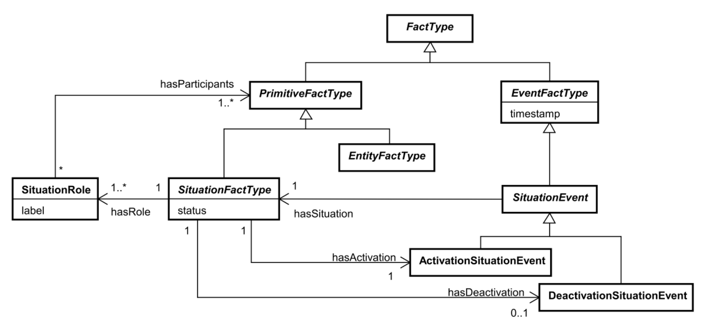
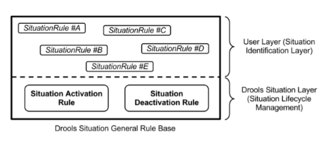
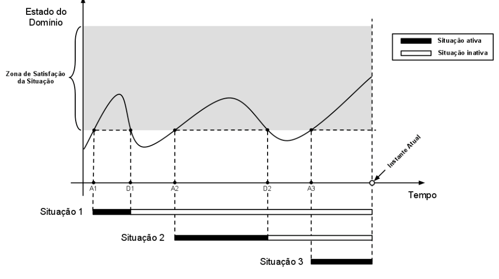
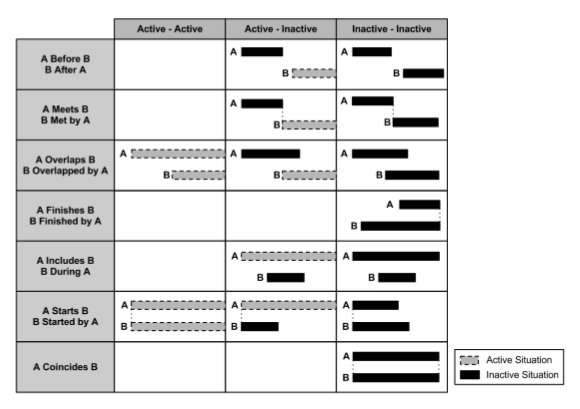

# Capitulo 2 - fundação teórica

## Contexto

Por mais natural que o conceito de *contexto* pareça, há uma certa dificuldade em clarificar sua definição no mundo acadêmico (Dey, 1999). Várias definições de áreas multidisciplinares podem ser encontradas e como esperado cada uma apresentando uma definição voltada para seu próprio domínio (Bradley, 2005).

O *Dicionário Aurélio* define *contexto* como: *"Conjunto de circunstâncias à volta de um acontecimento ou de uma situação"*. Em Linguistica (Fetzer, 1997) define-se contexto como *"um sistema tripartidário de mundos objetivos, subjetivos e sociais, seus sub sistemas e pressuposições"*. Em psicologia (Smith, 1988) define-se contexto como *"um conceito que denota uma grande variedade the caracteristicas intrinsicas e extrinsicas da apresentação de um item"*.

Desde o fim do século passado, pode-se observar contribuições para área de aplicações sensíveis ao contexto, particularmente na comunidade de Inteligência Artificial. Atualmente, com o grande desenvolvimento das tecnologias de comunicação e computação móvel e a proliferação dos dispositivos portáteis multifuncionais, contexto tornou-se um tópico destacado de pesquisas na comunidade de Ciência da Computação, recebendo especial interesse da nova área de pesquisa em Computação Pervasiva (“Ubiquitous / Pervasive Computing”) (WEISER, 1991). Tal area adere a noção de contexto como condições do meio que irão influenciar na adaptação de uma determinada aplicação, com o intuito de capacitar uma melhor inferência das necessidades do usuário. As definições de contexto divergem seu foco entre aplicação e usuário (Bradley, 2005). (Moran, 2001) define contexto como sendo *"situações fisico-sociais em que aparelhos computacionais estão envolvidos"*, em contraste (Dey, 1999) define *contexto* como sendo *"o estado informacional fisico, social e emocional de um usuário"*. Independente, a definição proposta por Dey para o que é *contexto* é a mais utilizada nesta area e adequada para este estudo.

De acordo com (Dey, 2001) *"contexto é qualquer informação que pode ser utilizada para caracterizar a situação de uma entidade. Uma entidade é uma pessoa, lugar ou objeto que é considerado relevante na interação entre usuário e aplicação, incluindo o usuário e aplicação em si"*. Logo, de acordo com essa definição, se um pedaço de informação é utilizado para caracterizar um participante da interação de um usuário com uma aplicação, esta informação é contexto.

Exemplos sobre o que é contexto segundo esta definição são: localização geográfica, intensidade da luz, temperatura do meio, distância do usuário até um certo objeto de interesse, etc. Uma Aplicação sensível ao contexto poderia, por exemplo, usar a informação da intensidade da luz ambiente em volta de um usuário para decidir um determinado padrão de cores visiveis em sua tela, garantindo assim um contraste menor, suavizando a experiência do usuário.

## Aplicações sensíveis ao contexto

Esta pesquisa segue como referência a noção de *aplicação sensível ao contexto* apresentada por Costa (2007) que a define como *"uma aplicação distribuida ao qual o comportamente é afetado pelo contexto do usuário"*. Tanto interações do usuário quanto informações providas atráves de *captura de contexto* fornecem dados significativos que influenciam na tomada de decisão da aplicação. Dey (2001), introduziu, também, uma definição semelhante para o que é uma *aplicação sensível ao contexto*, sendo essa:*"um sistema é sensível ao contexto se ele utiliza contexto para prover informação e/ou serviços relevantes para o usuário, em que a relevância depende das tarefas dos usuários"*.

Logo, entende-se uma *aplicação sensível ao contexto* como uma aplicação, que faz uso do contexto que engloba um usuário para fornecer um serviço melhor. Uma aplicação poderia, por exemplo, informar ao usuário informações sobre o que está acontecendo em um determinado ambiente a partir do momento que o próprio usuário entra naquele ambiente, usando de recursos como GPS.

\

Na Figura acima, a seta que liga *user* com *context aware application* mostra que o usuário e a aplicação sensível ao contexto interagem. Semelhantemente, a seta que liga *user's context* com *context aware application* mostra que o contexto do usuário e a aplicação sensível ao contexto também interagem. Interações usuário-aplicação podem ser exemplificadas como entradas fornecidas pelo usuário através de formulários, cliques em botões, mensagens de texto, etc, ou até mesmo utilização de serviços fornecidos pela aplicação, garantindo a bidirecionalidade. Interações contexto-aplicação pode ser permite com que a aplicação se adapte devido ao contexto informado.

Dey (2001) categoriza as aplicações sensíveis ao contexto segundo a finalidade a que elas se propõem:

* Apresentação de informação e serviços para o usuário

  Uma aplicação exibe uma série de impressoras em um dispositivo móvel, enfatizando as que estão mais próximas do dispositivo (SCHILIT, ADAMS e WANT, 1994), ou uma aplicação em que a orientação de exibição da interface é de acordo com a própria orientaçào do dispositivo (SCHMIDT, MICHAEL BEIGL e GELLERSEN, 1999).

* Execução automática de um serviço para o usuário

  Uma aplicação que inicia ações com base em informações contextuais, como por exemplo, acionar sprinkler em caso de identificação de fumaça, ou em cenários de risco onde a chamada de ambulâncias são geradas a partir da detecção de situações de risco. Tais condiçoes de risco poderiam ser avaliadas com base no monitoramento de contexto de um ou vários individuos, como sinais caridacos, temperatura, etc (PESSOA, CALVI, et al., 2006).

* Adição de contexto à informação para futuras recuperações.

  Uma aplicação de um clube que monitora e armazena informações de quem utilizou as quadras, em qual horário e para que, é armazenada e será possivelmente utilziado para tomar decisões de como melhor se aproveitar do meio.

## Tipos de Contexto e Esquema de Categorização

Abowd et al. [3] introduziu um dos principais mecânismos de definição de tipos de contexto. Eles identificavam localização, identidade, tempo e atividade como sendo tipos primários de contexto. Logo em seguida definiram como tipo secundáriod e contexto como sendo qualqer contexto que pode ser inferido a partir de contextos primários. Por exemplo tendo em mão a identidade uma dada pessoa, podemos adquirir informaçoes como telefone de contato, endereço, email, etc.

* Contexto primário: Qualqer informação recuperada diretamente do meio, sem utilização de qualquer forma de agregação de dados (ex: leituras GPS como informação de localização).
* Contexto secundário: Qualquer informaçao que pode ser computada usando contextos primários. Usando agregaçao de dados ou recuperação de dados passados (ex: utilizar agregação de duas leituras do contexto de localização de duas entidade diferentes para determinar a distância).

Perera (2014) apresenta uma discussão argumentando várias formas diferentes de classificação de contexto, argumentod seus prós e contras. Van Bunningen et al. [95] (2005) ao invés de categorizar cada tipo de contexto, classificaram duas formas de categorização de contexto: *operacional* e *conceitual*. A operacional normalmente foca o problema envolvendo a aquisição de dados enquanto a conceitual ajuda a entender os relacionamentos entre contextos.

Na perspectiva operacional, difere a aquisição e procedência do contexto. Sendo assim, razoavel a classificação de contexto como sendo primário, secundário, etc. Porém analisando somente esta perspectiva, podemos ter o mesmo tipo de dado, conceitualmente falando, caindo em categorias operacionais diferentes. Tenha como por exemplo a coleção de dados de pressão de um dado paciente. Se coletarmos a pressão através de sensores presentes no paciente, então este dado é considerado primário. Porém se obtermos a mesma informação olhando o histórico médico do paciente, o mesmo dado é considerado um contexto secundário. Logo, a mesma informação pode ser adquirida por diferentes tipos operacionais, tal categorização se preocupa com a qualidade, validade, acurácia, custo e esforço dado para adquirir o dado.

Em contraste a perspectiva conceitual foca em analisar os relacionamentos conceituais entre contexto. A localização GPS  e a distância calculada a partir da computação entre outras localizações, conceitualmente falando ainda estao categorizadas como sendo conceitos de localização, independente se são contexto primários ou secundários.

## Captura de contexto

Na definição fornecida por Costa (2007) de *aplicação sensível ao contexto* não há nenhuma distinção formal entre informação manualmente inserida na aplicação e informação automaticamente coletada (através de sensores, por exemplo). O processo de captura de contexto não influência na metodologia utilizada pela aplicação sensível ao contexto em si.

Cai sobre a aplicação a decisão do grau de ciência em relação a *modelagem de informação do contexto*. A aplicação pode ser totalmente alheia a como o contexto é adquirido, impossibilitando assim diferenciar a sua aquisição, ou então pode definir um grau de ciência sobre a informação do contexto quando houver interesse da aplicação avaliar a origem do mesmo. Fica totalmente a cargo da aplicaçao decidir tal nível de conhecimento.

Independente de tal ponto de vista, cinco fatores precisam ser considerados enquanto desenvolvendo uma soluçao do paradigma IoT, sendo estes fatores: responsabilidade, frequencia, origem do contexto, tipo de sensor e processo de aquisiçao (Perera, 2014).

*Responsabilidade* rege quem é o agente responsável por declarar atualizações de uma determinada fonte de dados. As duas principais formas de responsabildiade sao *pull* e *push*. Onde a primeira um software é responsável por periodicamente verificar os dados de um sensor, fisico ou virtual e na segunda o próprio sensor declara que ocorreu uma nova leitura de dados para o software.

*Frequência* envolve decidir se tal aquisiçao será periódica ou instantânea. Periódica implica estabeler um determinado intervalo onde ou o software fará o push, ou o sensor fará o pull para entregar os dados. Um sensor pode por exemplo ler dados instantaneamente do meio em que ele se encontra, porém ele acumula estes dados e só manda informações nova para o serviço de cinco em cinco minutos. O intantâneo, como próprio nome sugere, se refere a estratégia de informar a existencia de um dado novo assim que o mesmo se tornar presente.

*Origem do contexto* indica de onde dados de um determinado contexto vem. Através de sensores físicos, através de algum middleware que provê leituras sensoriais, através de um servidor de contexto, etc.

*Tipos de sensor* se refere a qualquer fonte de dados que provê informação contextual. Normalmente o termo sensor é utilizado para descrever o aparelho coletor de dados sensoriais do meio, como sensor GPS ou sensor de temperatura, porém a comunidade técnica abstrai tal conotação para ampliar em três possíveis tipos de sensores: fisicos, virtuais ou lógicos. Fisicos são sensores tangíveis que são compostos tanto por software e por hardware e são responsáveis por fazerem leituras do mundo real. Virtuais não necessáriamente geram dados eles mesmos, normalmente, sensores virtuais recuperam dados de várias fontes e publicam-nas como sendo dado sensorial. Sensores lógicos combinam tanto sensores virtuais quanto sensores fisicos com o intuito de formar dados sensoriais de uma camada mais abstrata que de outra forma seria impossível (ou muito dificil) de derivar diretamente por sensores fisicos ou virtuais. Um bom exemplo de sensores lógicos seriam serviços de previsões do tempo, eles combinam milhares de sensores fisicos de humidade, temperatura, pressão e localizaçao, juntamente com milhares de sensores virtuais de calendários, mapas e dados históricos para entao gerar dados lógicos a respeito de previsão temporária.

*Processo de aquisição* julga se dados sensoriais foram *percebidos*, *derivados* ou *manualmente inseridos* na aplicação sensível ao contexto. Para uma implementação de aplicação sensível ao contexto esta informação é de extrema importância para determinação de geração de dados. Digamos que uma aplicação quer medir a velocidade de uma pessoa para então ser capaz de inferir se a mesma está correndo ou andando, porém tal aplicação não dispõe de nenhum sensor fisico, virtual ou lógico que seja capaz de inferir diretamente a velocidade da pessoa. A própria aplicação poderia resolver este problema adquirindo o contexto de localização da pessoa constantemente. Através deste contexto *percebido* disponível do meio a aplicação seria capaz de gerar o contexto *derivado* velocidade média sendo esse a divisão das distâncias percorridas pelo tempo espaçado entre elas.

Apesar de existirem analises profundas de como deve ser adotada uma dada captura de contexto. costa (2007) defende que uma aplicação sensível ao contexto deve operar independente de como são capturadas as informações contextuais. Garantindo assim que aplicações sensíveis a contexto não sejam dependentes de suas fontes de contexto em si. Caso em algum momento um sensor fisico que fornece algum dado pare de funcionar, tecnicamente seria fácil substitui-lo por um virtual.

## Modelo de contexto

Costa (2007) apresenta modelo de contexto como *"a representação das condições ou circunstâncias do contexto que são relevantes para uma aplicação sensível a contexto"* e também distingue o processo de geração destes modelos em *"modelagem conceitual do contexto"* e *"modelagem da informação do contexto"*. Modelagem conceitual visa a definição de como um *contexto* e representado em um determinado cenário, tais modelos irão se abstrair da noção de como o *contexto* é sentido, provido, aprendido, produzido ou usado. Modelagem da informação do contexto por outro lado irá extender a noção da modelagem conceitual provendo o ferramental adequado para representar noções de como o *contexto* é sendito, provido, aprendido, produzido e ou usado.

Neste trabalho o foco é apresentar modelagem conceitual do contexto, abstraindo da modelagem da informação do contexto. Especificações conceituais são usadas para suportar o entendimento, solução do problema, e comunicação, entre os stakeholders sobre um determinado domínio. Uma vez que um entendimento e acordo sobre um determinado domínio é alcançado, a especificação conceitual é usada como um mapa para as subsequentes fases do desenvolvimento do sistema (GUIZZARDI, 2005). Então, a qualidade de uma aplicação sensível ao contexto está atrelada a qualidade dos modelos conceituais em que o desenvolvimento se baseia. A modelagem conceitual de contexto deve anteceder o design detalhado das aplicações sensíveis ao contexto, o da mesma forma que as análises devem anteceder design detalhado de um sistema de informação (COSTA, 2007).

## Modelo abstrato de contexto e situação

Uma aplicaçao sensível ao contexto pode ser vista como uma tentativa de associar informações sobre o meio através de sensações limitadas e erronêas (leituras sensoriais por exemplo) do universo a qual a mesma se engloba em níveis diferentes de abstração. Uma hierarquia de três niveis de abstração é definida como: O dado bruto que é recolhido do mundo real (coordenadas de latitude e longitude em um sensor GPS), a partir deste dado podemos gerar uma abstração de nível superior representando o contexto em si, podendo ser ele uma representação fiel do dado bruto (contexto *Localização*) ou até uma representação computada a partir de inferencias do dado bruto (contexto *Velocidade*) e por fim podemos subir mais ainda o nível de abstraçào que nos leva ao conceito de *situações* que podem ser inferidas das interações entre contextos (Padovitz, xxxx).


## Situações

Situações culminam como uma ajuda a conceptualização de partes da realidade que podem ser compreendidas como um todo (Pereira, 2013)

Em um ponto de vista de uma aplicação sensível ao contexto, situações seriam o próximo degrau à abstração de um modelo conceitual que melhor descreve as interações com o meio. Geralmente, estas aplicações não tem interesse em apenas o valor contextual, mas sim no que acarreta aquele valor. Por exemplo, uma aplicação de monitoramento de temperatura não quer apenas monitorar sua temperatura para ter o valor contextual de sua temperatura, a aplicação, possívelmente, quer inferir se você está em condições saudaveis de temperatura, em outra palavras, se você tem ou não febre. Logo a situação que melhor descreve o cenário desejado por tal aplicação culmina em "O paciente tem febre". O que, na verdade, é descrito como um *tipo de situaçào* que liga uma (ou mais) entidade condicionando essa ligação através do contexto que engloba tal entidade, A situação em si seria uma "instância" deste *tipo de situaçao* "O paciente tem febre", como por exemplo: "João tem febre".

Situações exibem propriedades temporais, tais como a duração com qual a situação ocorreu. Como exemplo temos a situação "João é casado com Maria" e "João é divorciado de Maria", em um intervalo de tempo contínuo precisamos agregar o detalhe de quando a situação ocorreu e até quando ela se mantém verdadeira. Dessa maneira podemos aproveitar da relação temporal que engloba uma situação para contruir situações mais complexas em cima.

Com a noção de situação, aplicações sensíveis a contextos são na verdade *aplicações sensíveis a situações*. Tais aplicações utilizam contextos e entidades a qual o contexto se refere para criar relações de parte do que está acontecendo no mundo real como situações. Em outras palavras, *Aplicações sensiveis a situações* recebem informação do mundo real e convertem as mesmas em um mapeamento significativo do o que pode estar acontecendo baseado em inferencias propostas por contextos, para que então ações possam ser tomadas.

### Detecção de Situação

Em computação pervasiva apresenta-se duas categorias de técnicas de detecção de situação: técnicas baseadas em especificação e técnicas baseadas em aprendizado (Ye et al, 2011).

Tecnicas baseadas em especificação são normalmente atribuídos em estágios mais básicos do desenvolvimento de uma aplicação sensível à situações, onde a relação entre o dado coletado do sensor e situações no meio é claro e transparente. Na medida em que a complexidade do problema aumenta e mais agentes detectores são introduzidos e/ou mais situações são mapeadas, fica evidente que escalabilidade não é tão trivial após um tempo, tanto devido a imprecisão introduzida pelos sensores quanto pela incapacidade das situações especificadas de realmente mapearem o problema. Tal técnica depende normalmente de um grande entedimento da area do problema envolvido (Ye et al, 2011), para garantir um melhor mapeamento do mesmo. Apesar de claras desvantagens no que diz respeito a escalabilidade, as técnicas baseadas em especificação tendem a ser amigaveis e maleaveis ao desenvolvedor. Destacam-se o uso extenso de lógicas formais envolvendo condicionadores lógicos e condicionadores temporais para escrita da especificação ao qual rege a situação. Como exemplos deste tipo de abordagem. Extendendo estas soluções, são citadas: a aplicação de Lógica Fuzzy e da Teoria de Evidência de Dempster-Shafer, como formas de lidar com determinados níveis de imprecisão, incompletude e inconsistência dos dados capturados via sensores.

As técinicas baseadas em aprendizado buscam aproveitar o poder de processamento disponível de outras áreas como mineração de dados, redes neurais, aprendizado de maquinas e outras técnicas (normalmente voltadas a inferência ou ao descobrimento de conceitos) para inferir um mapeamento sólido entre contextos e entidades e assim inferir situações. Uma série de derivados de modelos Bayesianos, Cadeias de Markov e entre outros são normalmente encontrados entre essas técnicas. Apesar de tais técnicas terem apresentado um bom resultado em identificar situações, elas necessitam de uma amostragem grande de dados de treinamento para que seja possível a criação de um modelo e parametrização do mesmo(Ye et al, 2011).

## Drools

### Sistemas baseados em Regras

De modo geral, uma regra é uma diretriz que aponta um curso usual, costumeiro, ou generalizado de ação ou comportamento sob certas condições. Ao construírmos uma aplicação, estamos invariavelmente aplicando regras ao caracterizarmos seu comportamento, decidindo uma sequência determinística de ações caso determinadas condições sejam satisfeitas. Tanto que em linguagens de programação tradicionais, por exemplo, as que seguem um padrão Algol (como C, C++, Java, etc...), podemos inferir o conjunto de lógica condicional provido pela linguagem como sendo suas *regras*, logo cada bloco que proporcione uma tomada de decisão (*if* e *else*), são vistos como regras da linguagem.

Sistemas baseados em Regras propõem uma separação clara entre aplicação e regras que compõem o mesmo. Compondo assim uma base de conhecimento, base de regras e uma máquina de inferência. Uma vantagem da utilização de tais sistemas é a separação evidente do conhecimento do domínio e do controle dos dados que envolvem o mesmo. Um exemplo clássico de um sistema baseado em regras é um sistema especializado de domínio específico que usa regras para fazer deduções ou escolhas. Por exemplo, um sistema especialista pode ajudar um médico a escolher o diagnóstico correto com base em um conjunto de sintomas.

A Base de Conhecimento representa um espaço de memória usado para armazenar a coleção de fatos que serão utilizados pelas regras (*working memory*). A working memory é usada pelo mecanismo de inferência para obter fatos e combiná-los com as regras. Os fatos podem ser adicionados à working memory aplicando algumas regras. Por exemplo, supondo uma aplicação que mede a temperatura de uma pessoa, a pessoa pode ser classificada como em estado febril se o valor de sua temperatura ultrapassar 36 graus.

A base de regras contém todas as definições de regras aplicáveis, representando, dessa forma, todo o comportamento da aplicação. A base define de que forma o conhecimento armazenado na working memory deverá ser usado. Uma regra é formada por uma tupla de precondição e conseqüência (se-então). A primeira, também conhecida como Left Hand Side (abreviadamente LHS), define as premissas impostas aos fatos para que a mesma seja satisfeita. A última, a Right Hand Side (RHS), é o conjunto de ações a serem executadas caso as precondições sejam atendidas.

A Máquina de Inferência decide quais regras são satisfeitas pelos fatos, e executa a regra com a maior prioridade. Existem dois tipos de inferência: encadeamento progressivo e encadeamento regressivo. Encadeamento progressivo é um raciocínio de fatos para a conclusão, enquanto encadeamento regressivo é um raciocínio de hipótese para os fatos que suportam esta hipótese. Se um mecanismo de inferência executa encadeamento progressivo ou encadeamento regressivo depende inteiramente do projeto que por sua vez depende do tipo de problema.
Encadeamento progressivo é mais adequado para o prognóstico, monitoramento e controle. O encadeamento regressivo é geralmente utilizado para problemas de diagnóstico. O mecanismo de inferência opera em ciclos, executando um grupo de tarefas até que determinados critérios façam parar a execução. As tarefas a serem feitas repetidamente podem conter alguma resolução de conflito, a serem consideradas antes da verificação de parada.

### Drools Rule Language

O sistema baseado em regras *Drools* tem uma linguagem de regras denominada Drools Rule language (DRL) (DRL, 2016), com uma sintaxe amigável e suporte para linguagens especificas de dominio através de *expansores* que permitem adaptar Drools.

```drools
rule "rule"
attributes
when
  Left Hand Side
then
  Right Hand Side
end
```

Left Hand Side (LHS) é o nome utilizado para definir a parte condicional da regra. Consiste em zero ou mais operadores lógicos temporais e condicionais. Right Hand Side é o nome utilizado para definir o bloco da linguagem especifica a ser executado caso a regra seja atendida

Basicamente uma regra em drools é definido por um conjunto de operadores lógicos temporais e condicionais que se encontram no LHS, que tem como papel decidir ou não a ativação da regra, e um RHS que denomina um conjunto de ações a serem tomados caso o LHS seja verdadeiro. O RHS em Drools é escrito na linguagem de programação *Java*.

### Truth Maintenance System

É um componente do Drools responsável pelo controle de inserções lógicas, que consiste em atrelar a existência do fato lógico à validade das condições da regra que o produziu, desencadeando o recolhimento automático do fato. Este conceito é particularmente interessante, pois, se aproxima da abordagem para detecção do fim de uma situação, isto é, quando as invariantes da situação não são mais satisfeitas pelos componentes de uma instância. Por exemplo, para que uma pessoa esteja com febre, sua temperatura tem que ser maior ou igual a 37ºC. O fato que caracteriza essa situação deve estar na working memory,. Portanto, se o fato é atualizado com a informação de que a temperatura da pessoa é 36ºC, significa que a condição que caracteriza a situação febre não é mais válida.  Portanto, o fato sobre a febre da pessoa é automaticamente recolhido da working memory.

## Scene

Com o objetivo de fazer uso do conceito abstrato de situação no desenvolvimento de aplicações sensíveis ao contexto, Pereira (2013) propôs *SCENE*, uma plataforma para a especificação, detecção e gerência de situações utilizando-se de *Drools* (e sua plataforma integrada de CEP) e aprimorando o mesmo para capacita-lo ao suporte nativo do desenvolvimento de aplicações sensíveis à situação. Tal plataforma permite a especificação de situações baseadas em regras e segue ideias conceituais sobre situações fornecidas em trabalhos como (Costa, Almeida, et al., 2006), (Costa, 2007) e (Costa, Mielke, et al., 2012).

### Máquina de estado de situações



A Figura 2.3 apresenta uma visão geral do modelo estrutural da máquina de situações para a base de conhecimento, da plataforma de situações, de forma que, todo elemento incluído na base de conhecimento é, ou torna-se, invariavelmente um fato, ou, como o modelo define, a classe *FactType* provida por *Drools*. Um objeto do tipo *FactType* denota que a máquina de inferência está ciente de sua existência e o considera no processo de casamento de padrões de regras.

Através da hierarquia do FactType podemos observar a classe EventFactType, que agrega métodos de correlação temporal, e os tipos restantes, classificados como PrimitiveFactTypes. Essa distinção é importante para expressar corretamente quais tipos de fatos podem participar de um tipo de situação, sendo representado por um SituationFactType, cujos papéis situacionais são descritos através de SituationRoles, implicando em que EntityFactTypes ou o próprio SituationFactType desempenham um papel na situação. A temporalidade não é uma propriedade de SituationFactType, mas sim, de seus derivados eventos, como na ativação um fato sobre a classe ActivationSituationEvent é gerado e relacionado com a instância do SituationFactType e o mesmo ocorre com a desativação, na qual um fato sobre a classe DeactivationSituationEvent é gerado e relacionado a uma instância do SituationFactType.

A situação permanece ativa enquanto as suposições tomadas que a tornaram ativa são ainda válidas, mas mesmo que a situação seja desativada ela permanecerá na working memory diferente de um fato inserido que é removido da working memory quando suas suposições se tornam falsas, pois a regra que cria a situação é interna a SCENE e não pela regra composta pelo usuário para a detecção da situação.



## Ciclo de vida de uma situação

Como citado em (número da seção q fala sobre situações), situações tem propriedades temporais que, na prática, acarreta em um ciclo de vida elaborado que representa o atual estado de envolvimento da situação. Tal clico consite em: identificação de um tipo de situação, instânciação, ativação e manutenção até então sua desativação. A instânciação representa o estabelecimento de um tipo de situação para um conjunto de entidades, dentro de um intervalo de tempo contínuo. O intervalo implica em um determinado momento de reconhecimento (ativaçao) do cumprimento das regras pré-estabelecidas, em tempo de desenvolvimento, que regem o tipo de situação e um determinado momento de reconhecimento da falta de veracidade desta mesmas regras (desativação). 



A figura provê uma representação gráfica do ciclo de vida de três situações instânciadas do mesmo tipo de situação. O eixo vertical representa variaveis que definem o estado das entidades que englobam o tipo de situação. O eixo horizontal representa a passagem do tempo. Para o entendimento do problema, suponha que tal tipo de situação só dependa exclusivamente de uma entidade *Pessoa* e seu contexto intrinseco *temperatura* e que estamos na verdade nos referindo a uma instância bem definida de *Pessoa*, "John" por exemplo. Esta situação poderia ser descrita como "John tem febre" e tal situação confirmaria como sendo verdade nos momentos em que a função ao qual estamos representando a variação da temperatura de "John" passa de um determinado limite pré-estabelecido (área cinza na figura). Tais caracteristica de uma situação demonstram que a mesma *nasce* (*ActivationSituationEvent*), dura um determinado intervalo de tempo e, logo em seguido, *morre* (*DeactivationSituationEvent*), este ciclo podendo, obviamente, repetir-se inúmeras vezes, cada uma gerando uma nova situação do mesmo tipo de situação.

## Relações temporais entre situações

Drools suporta nativamente operadores que correlacionam eventos de uma perspectiva temporal. Todos os treze operadores temporais de Allen são suportados assim como suas negações. Por exemplo, é possível definir que um evento aconteceu *antes* de outro, ou que dois eventos se *sobrepõem*. SCENE extende esta mesma intuição temporal para situações, permitindo assim argumentar temporalmente situações, pares de situações e eventos e eventos.



Coma noção temporal associada a uma situaçao seria possível a criação de regras mais complexas e regem situaçoes que possívelmente se compõem a partir de não só eventos mas também de outras situaçòes em si. Por exemplo, poderiamos definir "Pessoa tem febre" como sendo um tipo de situaçao que é caracterizada casa uma instancia de *Pessoa* apresente em seu contexto intrinseco *temperatura* um valor superior a 36 graus, independente da condição temporal, porém, uma *febre intermitente* pode ser definida como o acontecimento de multiplas febres (mais que uma) num espaço curto de tempo (1 dia, por exemplo) em um determinado individuo. Logo, seria possível definir o tipo de situação "Pessoa tem febre intermitente" como sendo o acontecimento de mais de uma instância de "Pessoa tem febre" da mesma entidade em um espaço temporal contínuo inferior de um dia, assim relacionando situações de forma tempoal.

## Referencias

N.A. Bradley and M.D. Dunlop, ìToward a Multidisciplinary Model of Context to Support Context-Aware Computingî, Human Computer Interaction, 2005, Volume 20, pp. 403 446.

Fetzer, A. (1997). Recontextualizing context. Proceedings of Context Organiser workshop at ECCS ’97

Smith, S. (1988). Environmental context-dependent memory. In G. M. Davies & D. M. Thomson (Eds.), Memory in context; context in memory (pp. 13–34). Chichester, England: Wiley.

C. Perera, A. Zaslavsky, P. Christen, D. Georgakopoulos, Context aware computing for the internet of things: A survey, Communications Surveys & Tutorials, IEEE 16 (1) (2014) 414–454.
