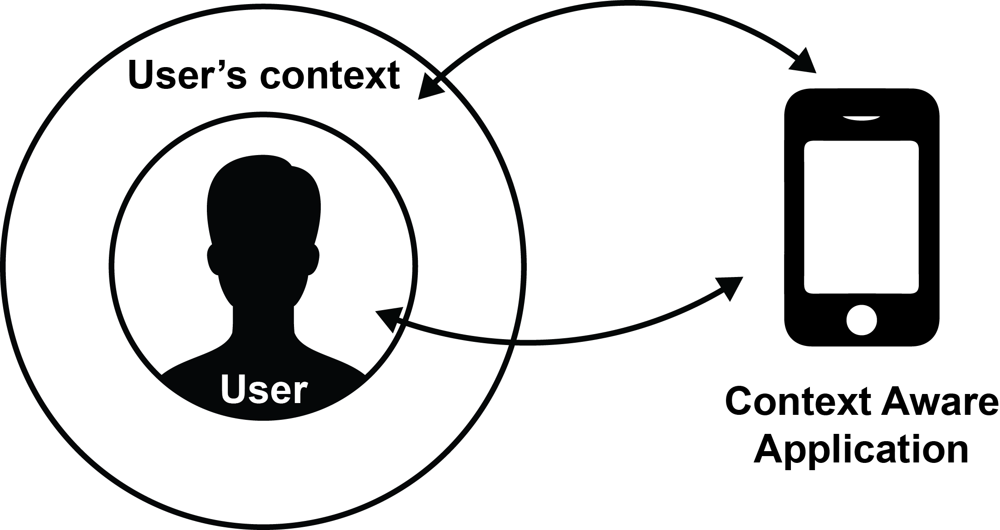
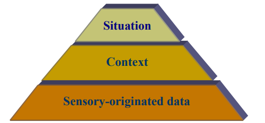

# Capitulo 2 - fundação teórica

## Contexto

Por mais natural que o conceito de *contexto* pareça, há uma certa dificuldade em clarificar sua definição no mundo acadêmico (Dey, 1999). Várias definições de áreas multidisciplinares podem ser encontradas e como esperado cada uma apresentando uma definição voltada para seu próprio domínio (Bradley, 2005).

O *Dicionário Aurélio* define *contexto* como: *"Conjunto de circunstâncias à volta de um acontecimento ou de uma situação"*. Em Linguistica (Fetzer, 1997) define-se contexto como *"um sistema tripartidário de mundos objetivos, subjetivos e sociais, seus sub sistemas e pressuposições"*. Em psicologia (Smith, 1988) define-se contexto como *"um conceito que denota uma grande variedade the caracteristicas intrinsicas e extrinsicas da apresentação de um item"*.

Desde o fim do século passado, pode-se observar contribuições para área de aplicações sensíveis ao contexto, particularmente na comunidade de Inteligência Artificial. Atualmente, com o grande desenvolvimento das tecnologias de comunicação e computação móvel e a proliferação dos dispositivos portáteis multifuncionais, contexto tornou-se um tópico destacado de pesquisas na comunidade de Ciência da Computação, recebendo especial interesse da nova área de pesquisa em Computação Pervasiva (“Ubiquitous / Pervasive Computing”) (WEISER, 1991). Tal area adere a noção de contexto como condições do meio que irão influenciar na adaptação de uma determinada aplicação, com o intuito de capacitar uma melhor inferência das necessidades do usuário. As definições de contexto divergem seu foco entre aplicação e usuário (Bradley, 2005). (Moran, 2001) define contexto como sendo *"situações fisico-sociais em que aparelhos computacionais estão envolvidos"*, em contraste (Dey, 1999) define *contexto* como sendo *"o estado informacional fisico, social e emocional de um usuário"*. Independente, a definição proposta por Dey para o que é *contexto* é a mais utilizada nesta area e adequada para este estudo.

De acordo com (Dey, 2001) *"contexto é qualquer informação que pode ser utilizada para caracterizar a situação de uma entidade. Uma entidade é uma pessoa, lugar ou objeto que é considerado relevante na interação entre usuário e aplicação, incluindo o usuário e aplicação em si"*. Logo, de acordo com essa definição, se um pedaço de informação é utilizado para caracterizar um participante da interação de um usuário com uma aplicação, esta informação é contexto.

Exemplos sobre o que é contexto segundo esta definição são: localização geográfica, intensidade da luz, temperatura do meio, distância do usuário até um certo objeto de interesse, etc. Uma Aplicação sensível ao contexto poderia, por exemplo, usar a informação da intensidade da luz ambiente em volta de um usuário para decidir um determinado padrão de cores visiveis em sua tela, garantindo assim um contraste menor, suavizando a experiência do usuário.

## Aplicações sensíveis ao contexto

Esta pesquisa segue como referência a noção de *aplicação sensível ao contexto* apresentada por Costa (2007) que a define como *"uma aplicação distribuida ao qual o comportamente é afetado pelo contexto do usuário"*. Tanto interações do usuário quanto informações providas atráves de *captura de contexto* fornecem dados significativos que influenciam na tomada de decisão da aplicação. Dey (2001), introduziu, também, uma definição semelhante para o que é uma *aplicação sensível ao contexto*, sendo essa:*"um sistema é sensível ao contexto se ele utiliza contexto para prover informação e/ou serviços relevantes para o usuário, em que a relevância depende das tarefas dos usuários"*.

Logo, entende-se uma *aplicação sensível ao contexto* como uma aplicação, que faz uso do contexto que engloba um usuário para fornecer um serviço melhor. Uma aplicação poderia, por exemplo, informar ao usuário informações sobre o que está acontecendo em um determinado ambiente a partir do momento que o próprio usuário entra naquele ambiente, usando de recursos como GPS.

\

Na Figura acima, a seta que liga *user* com *context aware application* mostra que o usuário e a aplicação sensível ao contexto interagem. Semelhantemente, a seta que liga *user's context* com *context aware application* mostra que o contexto do usuário e a aplicação sensível ao contexto também interagem. Interações usuário-aplicação podem ser exemplificadas como entradas fornecidas pelo usuário através de formulários, cliques em botões, mensagens de texto, etc, ou até mesmo utilização de serviços fornecidos pela aplicação, garantindo a bidirecionalidade. Interações contexto-aplicação pode ser permite com que a aplicação se adapte devido ao contexto informado.

Dey (2001) categoriza as aplicações sensíveis ao contexto segundo a finalidade a que elas se propõem:

* Apresentação de informação e serviços para o usuário

  Uma aplicação exibe uma série de impressoras em um dispositivo móvel, enfatizando as que estão mais próximas do dispositivo (SCHILIT, ADAMS e WANT, 1994), ou uma aplicação em que a orientação de exibição da interface é de acordo com a própria orientaçào do dispositivo (SCHMIDT, MICHAEL BEIGL e GELLERSEN, 1999).

* Execução automática de um serviço para o usuário

  Uma aplicação que inicia ações com base em informações contextuais, como por exemplo, acionar sprinkler em caso de identificação de fumaça, ou em cenários de risco onde a chamada de ambulâncias são geradas a partir da detecção de situações de risco. Tais condiçoes de risco poderiam ser avaliadas com base no monitoramento de contexto de um ou vários individuos, como sinais caridacos, temperatura, etc (PESSOA, CALVI, et al., 2006).

* Adição de contexto à informação para futuras recuperações.

  Uma aplicação de um clube que monitora e armazena informações de quem utilizou as quadras, em qual horário e para que, é armazenada e será possivelmente utilziado para tomar decisões de como melhor se aproveitar do meio.

## Categorias de contexto

Tão descentralizado quanto pareça a definição de *contexto*, sua categorização é ainda mais aberta a discussão. (Perera, 2014) apresentou uma comparação extensa entre várias, incluindo seus relacionamento, vantagens e desvantagens. É reconhecido duas classificações de categorias de contexto: *operacional* e *conteitual*. A operacional normalmente foca o problema envolvendo a aquisição de dados enquanto a conceitual ajuda a entender os relacionamentos entre contextos. Ambas classificações faltam a capacidade de conter todo conhecimento necessário para o desenvolvimento de uma aplicação sensível a contexto por si só.

## Modelos de contexto

(Costa, 2007) apresenta modelo de contexto como *"a representação das condições ou circunstâncias do contexto que são relevantes para uma aplicação sensível a contexto"* e também distingue o processo de geração destes modelos em *"modelagem conceitual do contexto"* e *"modelagem da informação do contexto"*. Modelagem conceitual visa a definição de como um *contexto* e representado em um determinado cenário, tais modelos irão se abstrair da noção de como o *contexto* é sentido, provido, aprendido, produzido ou usado. Modelagem da informação do contexto por outro lado irá extender a noção da modelagem conceitual provendo o ferramental adequado para representar noções de como o *contexto* é sendito, provido, aprendido, produzido ou usado.

## Captura de contexto

Na definição fornecida por Costa (2007) de *aplicação sensível ao contexto* não há nenhuma distinção formal entre informação manualmente inserida na aplicação e informação automaticamente coletada (através de sensores, por exemplo). O processo de captura de contexto não influência na metodologia utilizada pela aplicação sensível ao contexto em si.

Cai sobre a aplicação a decisão do grau de ciência em relação a *modelagem de informação do contexto*. A aplicação pode ser totalmente alheia a como o contexto é adquirido, impossibilitando assim diferenciar a sua aquisição, ou então pode definir um grau de ciência sobre a informação do contexto quando houver interesse da aplicação avaliar a origem do mesmo. Fica totalmente a cargo da aplicaçao decidir tal nível de conhecimento

> acho que vale plantar a questão de que pra uma arquitetura de implementação pode sim fazer diferença a questão de inferido/percebido, e o seu trabalho contribui nisso

## Modelo abstrato de contexto e situação

Uma aplicaçao sensível ao contexto pode ser vista como uma tentativa de associar informações sobre o meio através de sensações limitadas e erronêas (leituras sensoriais por exemplo) do universo a qual a mesma se engloba em níveis diferentes de abstração. Uma hierarquia de três niveis de abstração é definida como: O dado bruto que é recolhido do mundo real (coordenadas de latitude e longitude em um sensor GPS), a partir deste dado podemos gerar uma abstração de nível superior representando o contexto em si, podendo ser ele uma representação fiel do dado bruto (contexto *Localização*) ou até uma representação computada a partir de inferencias do dado bruto (contexto *Velocidade*) e por fim podemos subir mais ainda o nível de abstraçào que nos leva ao conceito de *situações* que podem ser inferidas das interações entre contextos(Padovitz, xxxx).

## Situações

----

### Referencias

N.A. Bradley and M.D. Dunlop, ìToward a Multidisciplinary Model of Context to Support Context-Aware Computingî, Human Computer Interaction, 2005, Volume 20, pp. 403 446.

Fetzer, A. (1997). Recontextualizing context. Proceedings of Context Organiser workshop at ECCS ’97

Smith, S. (1988). Environmental context-dependent memory. In G. M. Davies & D. M. Thomson (Eds.), Memory in context; context in memory (pp. 13–34). Chichester, England: Wiley.

C. Perera, A. Zaslavsky, P. Christen, D. Georgakopoulos, Context aware computing for the internet of things: A survey, Communications Surveys & Tutorials, IEEE 16 (1) (2014) 414–454.
